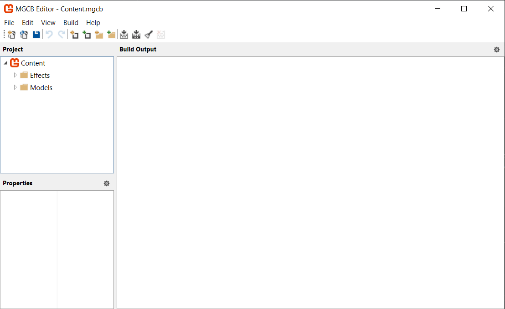
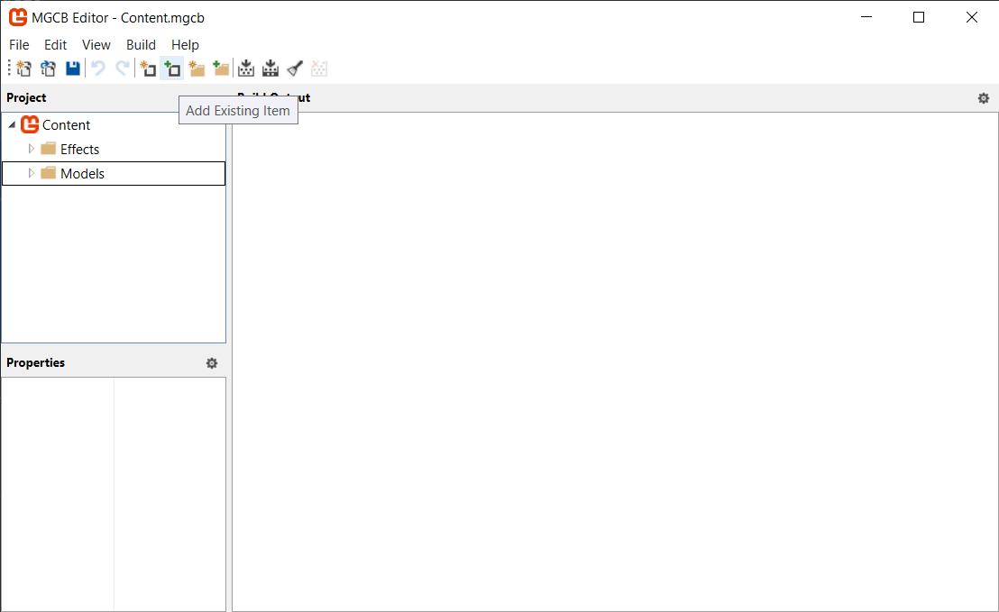
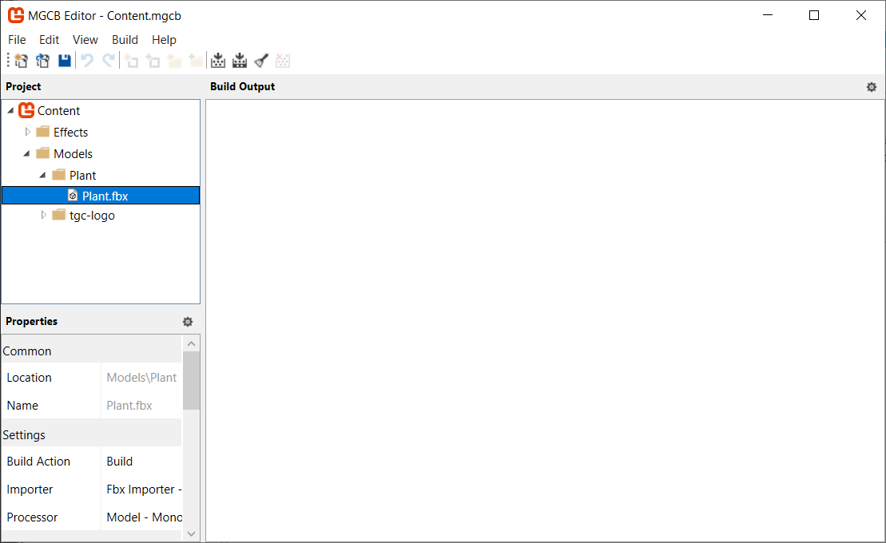
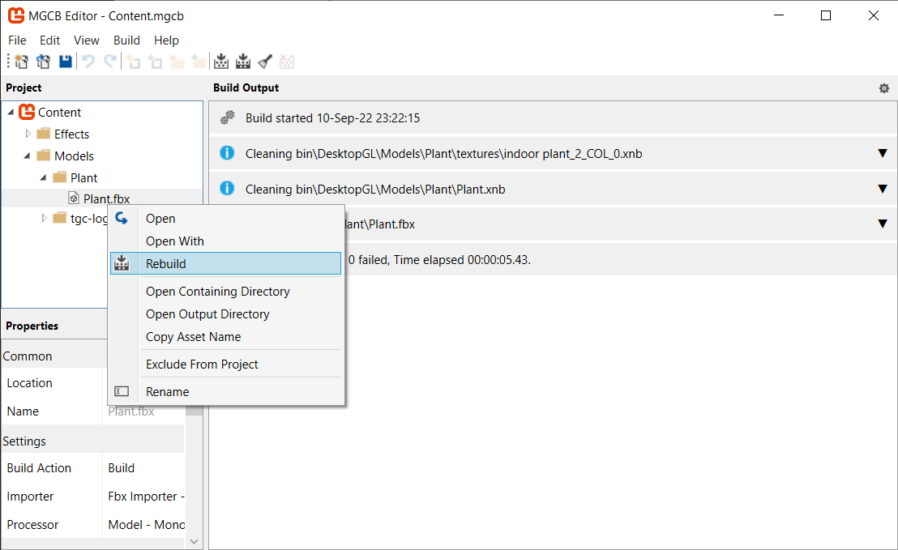
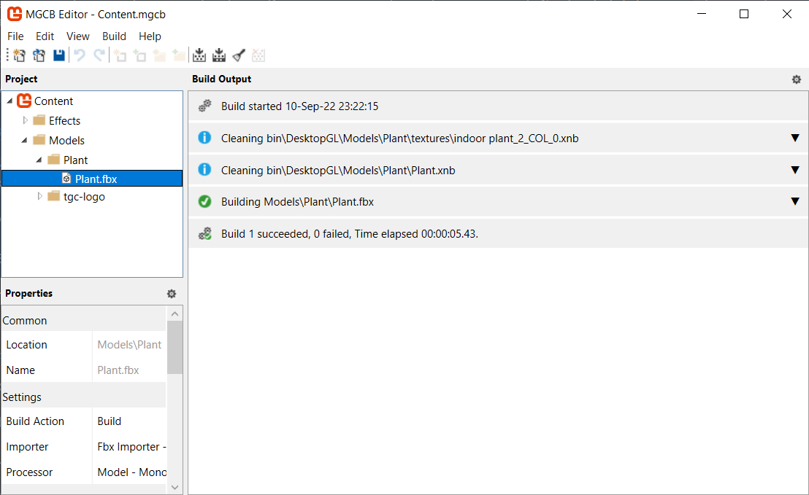

# 🧵 Guía para importar modelos 3D en MonoGame 🎮

## Tabla de contenidos

1. [Tabla de contenidos ℹ️](#tabla-de-contenidos)
2. [Introducción 🖥️](#introducción)
3. [Pasos para importar un modelo 3D 🧊](#pasos-para-importar-un-modelo-3d)
    1.  [Buscar un modelo 3D](#buscar-un-modelo-3d)
    2.  [Importar el modelo en el Content Editor](#importar-el-modelo-en-el-content-editor)
    3.  [Compilar el Content Editor](#compilar-el-content-editor)
    4.  [Cargar el modelo desde MonoGame](#cargar-el-modelo-desde-monogame)
    5.  [Mostrar el modelo](#mostrar-el-modelo)
4. [Restricciones del Trabajo Práctico 📜](#restricciones-del-trabajo-práctico)
5. [Dibujando meshes con colores distintos 🎨](#dibujando-meshes-con-colores-distintos)

## Introducción

Los __modelos tridimensionales__ son actores principales en la asignatura Técnicas de Gráficos por Computadora 🖥️. Nos permiten representar objetos y efectos en un escenario.
Principalmente usamos los que están formados por triángulos 🔺, que tienen tres vértices 🔹 y estos pueden tener distintos atributos. No todos los modelos tienen los mismos atributos, pero todos los vértices tienen por lo menos una posición (en espacio local).
Esta guía muestra cómo importar estos modelos desde distintos formatos a MonoGame, la herramienta que usa la cátedra para el trabajo práctico cuatrimestral 🙌.

## Pasos para importar un modelo 3D

### Buscar un modelo 3D

Las fuentes de modelos 3D 🧊 pueden ser varias. Podemos crear nuestras propias geometrías, especificando atributos y creando índices para que cada primitiva (generalmente triángulos) sepa por qué vértices está compuesta. Para crear geometría de manera procedural (por código), referir a los ejemplos "Tutorial 1" hasta "Tutorial 6" del proyecto [Samples](https://github.com/tgc-utn/tgc-monogame-samples).


En esta guía vamos a buscar modelos 3D en páginas web por simplicidad. Los formatos que MonoGame acepta por el momento son FBX, OBJ y DAE, por lo que podemos usar esta [página web](https://free3d.com/) para encontrar algún archivo que sea útil. Por ejemplo, esta [🪴 planta 🪴](https://free3d.com/3d-model/indoor-pot-plant-77983.html) es candidata a ser parte de nuestra aplicación gráfica. _Es importante conocer siempre la licencia de un recurso que vamos a utilizar y aplicarla de manera correcta. La asignatura no se hace cargo del uso indebido de licencias de recursos no provistos por la cátedra, ya que su uso dentro de la misma nunca es comercial._

Los recursos que encontramos en distintos medios pueden contener archivos que no necesitamos, o estar estructurados de maneras distintas. En este caso, la planta tiene varios archivos comprimidos. **Como preferentemente buscamos archivos FBX, los extraemos de la carpeta indicada ("indoor plant_02_fbx.zip").** Al contener dos archivos de ese formato, podemos elegir cualquiera y probar que funcione, pero en este caso particular es porque usan especificaciones distintas de FBX.
Siempre es posible visualizar el modelo en cualquier herramienta externa como [Blender](https://www.blender.org/), Windows 3D Viewer o [3D Viewer](https://3dviewer.net/). 

También podríamos extraer las texturas si las necesitamos, pero por ahora no es necesario. Hay veces que las texturas están embebidas dentro del modelo 3D en sí, para eso es importante ver nuestro archivo en alguna herramienta antes de probarlo en MonoGame.
En otra guía se va a cubrir el uso de texturas.

### Importar el modelo en el Content Editor

Si ya encontraste el modelo 3D ideal para tu aplicación gráfica, lo que sigue es importarlo en tu proyecto de MonoGame. Para eso, 
mové el archivo FBX a una carpeta dentro de `{repositorio}/{solución}/Content/Models` (es importante que esté dentro de la carpeta Content). Por ejemplo, para esta guía se movieron y renombraron los archivos para que queden en la siguiente disposición:
```
/tgc-monogame-tp
    /TGC.MonoGame.TP
        /Content
            /Models
                /Plant
                    /Models
                        /Plant.fbx
                        /textures
                            /indoor plant_2_vl.png
                            /...
```

Si bien se renombró el archivo `"indoor plant_02_+2.fbx"` a `"Plant.fbx"`, los archivos y carpetas de texturas no se renombraron porque en algunos casos los modelos 3D hacen uso de rutas relativas y necesitan que estas no se cambien. De cualquier manera las texturas pueden ser importadas a mano en un futuro.

Luego de mover los archivos a esa carpeta, resta importarlos. Para eso, simplemente usamos el Content Editor. Esta herramienta se encuentra instalada de manera local, y para ejecutarla hay que correr el comando `dotnet mgcb-editor .\Content\Content.mgcb` desde el proyecto (en este caso, `tgc-monogame-tp/TGC.MonoGame.TP`) y apuntar al archivo `Content.mgcb`.
Generalmente se encuentra en `{repositorio}/{proyecto}/Content/Content.mgcb`. Al ejecutar este comando, obtenemos una imagen parecida a esta:



Hacemos click en el ícono de `"Add Existing Item"`:



Buscamos la carpeta `{repositorio}/{solución}/Content/Models/{modelo}`, en este caso `Plant`,  y hacemos click en el archivo del modelo. Por ahora, no vamos a importar texturas. Luego, deberíamos expandir `Models > Plant > Plant.fbx` y ver el modelo ahí. 



### Compilar el Content Editor

Si le damos click derecho al archivo y elegimos la opción `"Rebuild"`, debería compilar sin errores. Si hay errores, podemos buscar  la causa del error y resolverla, postear el problema en Discord/Google Groups o buscar otro modelo. Si el modelo compila satisfactoriamente, ya podemos usarlo en MonoGame.





### Cargar el modelo desde MonoGame

Lo que resta es cargar el modelo desde el código de nuestra aplicación gráfica. Para eso, en el método `LoadContent` hacemos 
```cs
// Declaramos nuestro Model, generalmente queremos que exista como variable de clase
private Model _model;

protected override void LoadContent()
{
    // Cargamos nuestro modelo desde Disco
    // Usamos la ruta relativa. ContentFolder3D nos da la ubicación de la carpeta en donde están los modelos.
    // Plant es la carpeta en donde está el modelo y Plant es el nombre del archivo sin el formato.
    // Si el archivo se llamara "Table" dentro de la carpeta "Kitchen" la línea sería 
    // _model = Content.Load<Model>(ContentFolder3D + "/Kitchen/Table");
    
    _model = Content.Load<Model>(ContentFolder3D + "/Plant/Plant");
    
    // ...
}
```

Si ejecutamos la aplicación, `LoadContent` debería cargar nuestro modelo sin ningún problema, pero no vamos a verlo todavía.

### Mostrar el modelo

Para mostrar el modelo se pueden usar varias técnicas. La que vamos a mostrar a continuación es la más fácil pero no está permitida en el Trabajo Práctico Cuatrimestral (sí en el TP Cero), porque tenemos que implementar nuestra propia lógica de dibujado.

```cs

private Matrix _world, _view, _projection;

protected override void Draw(GameTime gameTime)
{
    // De esta manera, dibujamos nuestro modelo con una matriz de mundo, vista y proyeccion.
    // La matriz de vista y proyeccion dependen de la aplicacion gráfica y la abstraccion de cámara elegida.
    // La matriz de mundo depende de cada objeto.
    _model.Draw(_world, _view, _projection);
}
```

Este método simplemente dibuja el modelo 3D usando las matrices dadas. Si tenemos suerte, hasta puede encontrar las texturas y aplicarlas. Esta forma de renderizar modelos es bastante automágica pero implementa el `BasicEffect` de MonoGame, por lo que si estás probando un modelo en particular está bien, pero para una entrega del Trabajo Práctico Cuatrimestral no es suficiente.

## Restricciones del Trabajo Práctico

Para dibujar el modelo de la forma que se necesita para el Trabajo Práctico Cuatrimestral, se debe hacer uso de las siguientes líneas:

```cs
private Matrix _world, _view, _projection;

protected override void LoadContent()
{
    // ...
    foreach (var mesh in _model.Meshes)
        // Un mesh puede tener mas de una mesh part (cada una puede tener su propio efecto).
        foreach (var meshPart in mesh.MeshParts)
            meshPart.Effect = Effect;
}

protected override void Draw(GameTime gameTime)
{
    Effect.Parameters["View"].SetValue(_view);
    Effect.Parameters["Projection"].SetValue(_projection);
    Effect.Parameters["DiffuseColor"].SetValue(Color.Red.ToVector3());

    var modelMeshesBaseTransforms = new Matrix[_model.Bones.Count];
    Model.CopyAbsoluteBoneTransformsTo(modelMeshesBaseTransforms);
    foreach (var mesh in _model.Meshes)
    {
        var relativeTransform = modelMeshesBaseTransforms[mesh.ParentBone.Index];
        Effect.Parameters["World"].SetValue(relativeTransform * World);
        mesh.Draw();
    }
}
```

Esto dibuja un modelo 3D con un color arbitrario (🔴 rojo en este caso). El método `CopyAbsoluteBoneTransformsTo` copia todas las 🔢 Matrices 🔢 que contiene el modelo para dibujar Meshes a un array. El modelo contiene matrices en forma relativa, y para dibujarlo necesitamos estas Matrices de forma absoluta. Vamos a ahondar más en eso en el siguiente Tutorial, por ahora es importante saber que tenemos las Matrices absolutas y es necesario multiplicar la de cada Mesh por la Matriz de Mundo de todo el modelo 🙌.

## Dibujando Meshes con colores distintos

Si queremos dibujar varios modelos con distintos colores, basta con repetir las últimas líneas y asignarle otro color al efecto. Hasta podríamos definir un método que dibuja cada Mesh con un color aleatorio:

```cs
private Random _random;
private const int SEED = 0;

protected override void Draw(GameTime gameTime)
{
    GraphicsDevice.Clear(ClearOptions.Target, Color.Black, 1f, 0);
    Effect.Parameters["View"].SetValue(_view);
    Effect.Parameters["Projection"].SetValue(_projection);
    _random = new Random(SEED);
    DrawModel(_model, _world, _random);
}

private void DrawModel(Model model, Matrix world, Random random)
{
    var modelMeshesBaseTransforms = new Matrix[model.Bones.Count];
    model.CopyAbsoluteBoneTransformsTo(modelMeshesBaseTransforms);
    foreach (var mesh in model.Meshes)
    {
        var relativeTransform = modelMeshesBaseTransforms[mesh.ParentBone.Index];
        Effect.Parameters["World"].SetValue(relativeTransform * world);
        Effect.Parameters["DiffuseColor"].SetValue(RandomColor(_random).ToVector3());
        mesh.Draw();
    }
}

private Color RandomColor(Random random)
{
    // Construye un color aleatorio en base a un entero de 32 bits
    return new Color((uint)random.Next());
}
```

De esta forma, cada Mesh perteneciente a un modelo se va a dibujar con un color aleatorio 🌈, y al construir el objeto Random en cada _Draw_ con la misma 🌱 Seed 🌱 (semilla), nos aseguramos que devuelva siempre los mismos valores en el mismo orden, y así podemos volver a dibujar todos los modelos con los mismos colores que el frame anterior.

Eso fue todo por este Tutorial. Si tenés dudas sobre los métodos o técnicas que se usaron en este artículo, por favor preguntá en Discord o abrí una Issue en GitHub. 

✨ Saludos ✨ 
