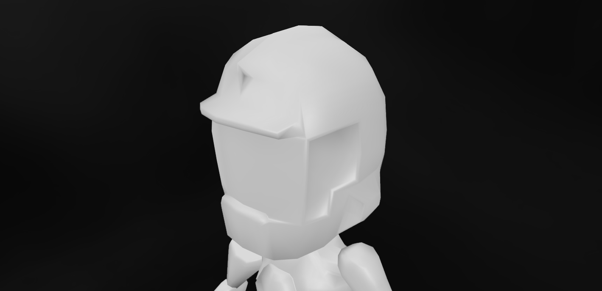
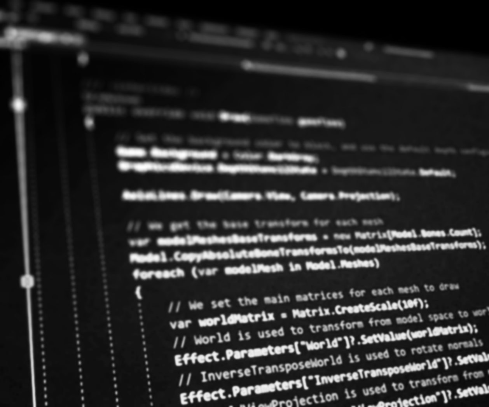
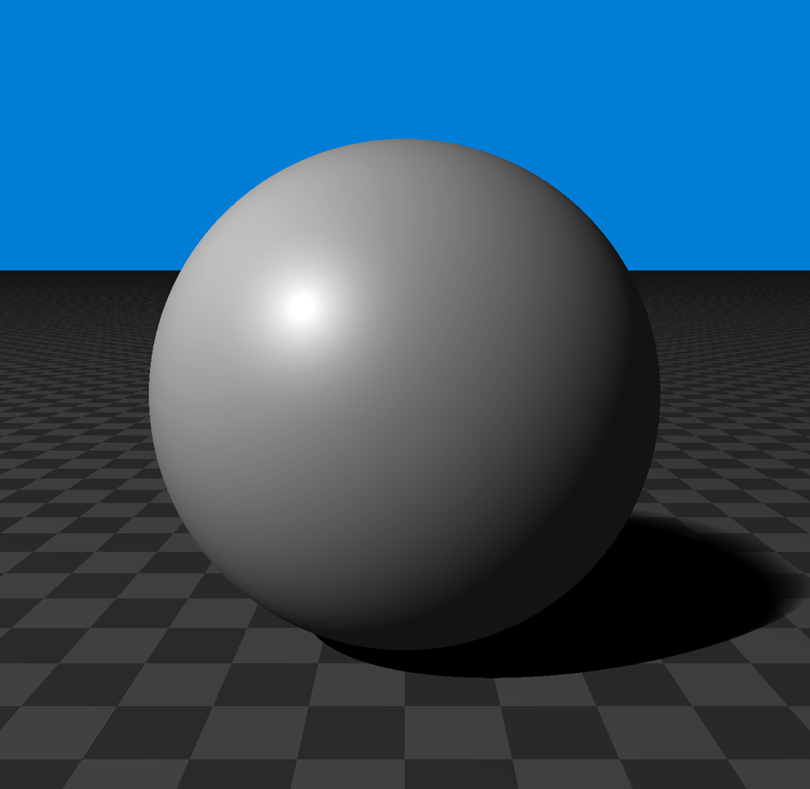

{: .home-logo .d-flex .flex-justify-around}
# Técnicas de Gráficos por Computadora
{: .home-title .d-flex .flex-justify-around}

## ¡Hola!
{: .d-flex .flex-justify-around}

Este es el sitio oficial de Técnicas de Gráficos por Computadora,
la materia de tercer año de la Universidad Tecnológica Nacional, Facultad Regional Buenos Aires.
Acá vas a poder encontrar todos los recursos que necesites para la cursada.

{: .d-flex .flex-justify-around .home-image}
### Gráficos por Computadora
{: .home-title .d-flex .flex-justify-around}
Llamamos Gráficos por Computadora al campo de las ciencias de la computación que se dedica a la generación de imágenes digitales.
En esta asignatura nos enfocamos en Aplicaciones Gráficas en Tiempo Real[^rti], muy utilizadas en el mundo de la arquitectura, videojuegos, medicina, y más.

Quiere decir que nos alejamos de los sistemas orientados a eventos, comunes en otras materias, y nos adentramos en los sistemas en tiempo real:
¡Nuestro código responde muchas veces por segundo!

El objetivo es formar personas en los fundamentos de esta área y otorgar los conocimientos necesarios para poder crear este tipo de aplicaciones, que puedan aprender los desarrollos más recientes sin dificultad.

### ¿Cuales son las condiciones de aprobación?
{: .home-title .d-flex .flex-justify-around}
Para aprobar la asignatura es necesario realizar un [trabajo teórico práctico integrador]() en el cual se implementan todos los conocimientos adquiridos durante la cursada y un parcial teórico práctico.

{: .d-flex .flex-justify-around .home-image}
### ¿Cómo se desarrolla la materia?
{: .home-title .d-flex .flex-justify-around}

Durante la cursada, se exploran los contenidos teóricos que conllevan dibujar modelos tridimensionales en tiempo real.

Cómo se compone un modelo, puntos en el espacio, transformaciones para llevarlo a la pantalla, y técnicas para iluminarlo junto con distintos efectos que se pueden lograr.

{: .d-flex .flex-justify-around .home-image}
### ¿Esto significa que voy a tener que hacer modelos 3D?
{: .home-title .d-flex .flex-justify-around}
**¡No!**
la asignatura está orientada no a los recursos en una aplicación gráfica (modelos, texturas, sonidos) sino estrictamente a la programación, no evaluamos diseño gráfico. 

Te vamos a dar los modelos necesarios para tu TP. Si aún querés usar un modelo propio, podes, pero tené en cuenta que el tiempo que dediques a hacer andar un modelo es tiempo que no dedicas a la parte que se evalúa!

### ¿Que tengo que saber de matemática para poder cursar?
{: .home-title .d-flex .flex-justify-around}

Tanto la teoría como la práctica requieren de conocimientos en matemática, vistos en las materias homogéneas de la carrera.
 * Cálculo vectorial
 * Álgebra de matrices
 * Coordenadas Cartesianas, Polares, y cómo ir de una a otra
 * Geometría del espacio (Puntos, Rectas y Planos)

Como trabajamos con modelos, puntos y espacios, también es importante que desempolves tus apuntes de geometría. No vamos a derivar ni integrar.

¿Necesitás un repaso? Te cubrimos, [Matemática para gráficos]().

[^rti]: Aquellas aplicaciones que tienen que responder en un intervalo de tiempo determinado, usualmente corto.

